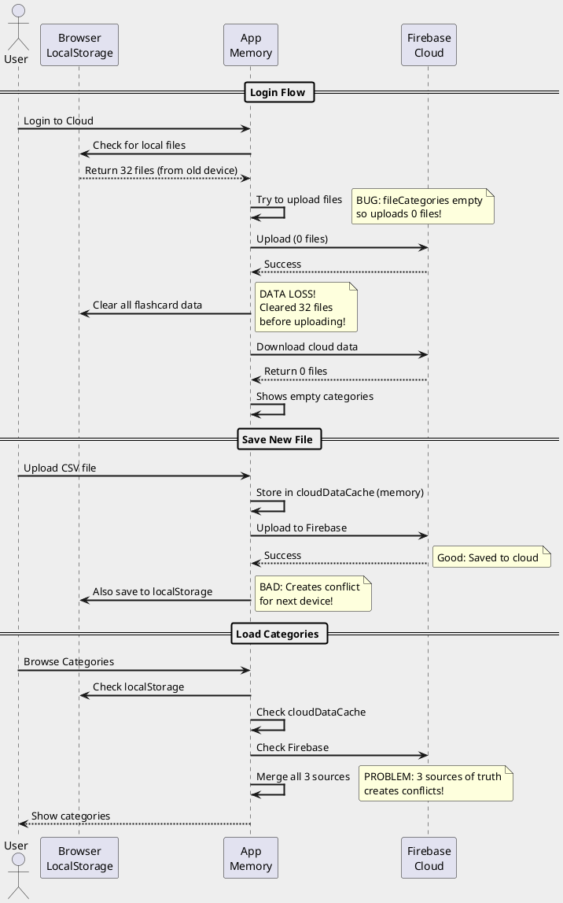
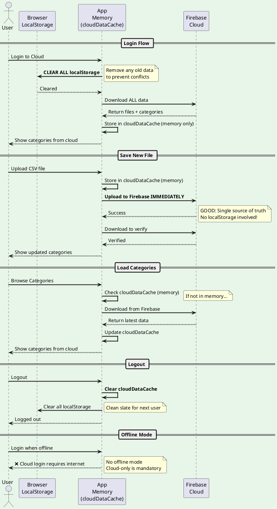

# Cloud-Only Mode Flow Documentation

## Problem Statement
User experienced data loss when logging in from different devices because:
1. localStorage on different devices had conflicting data
2. App tried to merge localStorage with cloud data
3. Empty localStorage overwrote cloud data

## Solution: Pure Cloud-Only Mode
When logged into cloud, **completely ignore localStorage** and work only with cloud data.

---

## Current Flow (PROBLEMATIC)

---

## Desired Flow (CLOUD-ONLY MODE)

---

## Key Differences

| Aspect | Current (Problematic) | Desired (Cloud-Only) |
|--------|----------------------|----------------------|
| **Data Storage** | localStorage + cloud + memory | Cloud + memory only |
| **Login** | Tries to merge localStorage with cloud | Clears localStorage, downloads from cloud |
| **Save** | Saves to cloud + localStorage | Saves to cloud only |
| **Load** | Reads from 3 places | Reads from cloud only |
| **Multi-Device** | Conflicts between devices | Always synced via cloud |
| **Offline** | Works offline with localStorage | Requires internet (cloud mandatory) |

---

## Implementation Plan

### Phase 1: Clear localStorage on Cloud Login ✅
- When user logs in to cloud, clear ALL localStorage immediately
- Prevents old data from interfering

### Phase 2: Disable localStorage Writes in Cloud Mode ✅
- Add flag: `isCloudOnlyMode = true`
- All save operations skip localStorage when flag is true
- Only write to cloudDataCache + Firebase

### Phase 3: Cloud-Only Load Operations ✅
- Remove all localStorage reads when cloud is enabled
- Load from cloudDataCache (memory) or Firebase only
- If not in memory, fetch from Firebase

### Phase 4: Prevent localStorage Fallback ✅
- Remove all code paths that fall back to localStorage
- Show error if cloud connection fails instead of using localStorage

---

## Benefits of Cloud-Only Mode

1. **No Data Loss**: Single source of truth (Firebase)
2. **No Conflicts**: No merging between localStorage and cloud
3. **Multi-Device**: Works perfectly across all devices
4. **Simpler Code**: One data path instead of three
5. **Always Fresh**: Always loads latest data from cloud

---

## Risks & Mitigations

| Risk | Mitigation |
|------|-----------|
| Internet required | Show clear error when offline |
| Slower loads | Cache in memory (cloudDataCache) |
| Firebase quota | Warn user if approaching limits |
| Network failures | Retry logic + error messages |
| Accidental logout | Confirm before logout |

---

## Testing Checklist

- [ ] Login from Device A → Upload files → Logout
- [ ] Login from Device B → Should see exact same files
- [ ] Upload new file from Device B
- [ ] Login from Device A again → Should see new file
- [ ] Check localStorage on both devices → Should be empty
- [ ] Try to login offline → Should show error
- [ ] Test with 100+ files → Performance acceptable

---

## Migration Notes

For existing users with localStorage data:
1. First login will detect localStorage files
2. Upload them to cloud (with fixes applied)
3. Clear localStorage after successful upload
4. Future logins will be cloud-only

---

Generated: 2025-12-05
Version: 3.0-cloud-only
