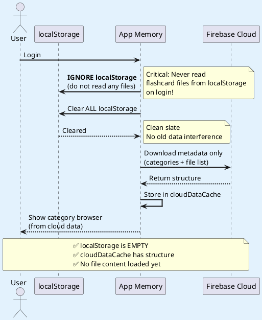
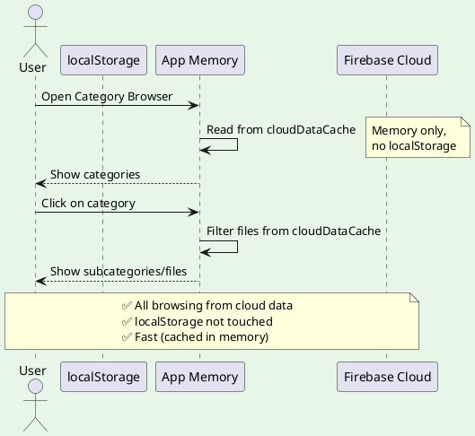
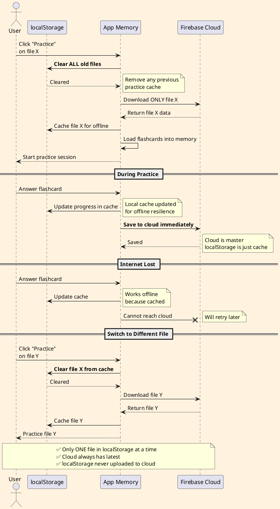
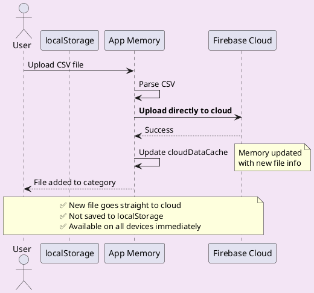
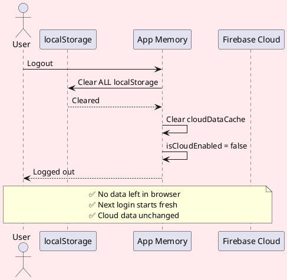

# Hybrid Cloud-Master + Practice-Cache Flow

## Architecture Overview

```
┌─────────────────────────────────────────────────────────────┐
│                    FIREBASE CLOUD                            │
│                  (MASTER / SOURCE OF TRUTH)                  │
│                                                              │
│  ✅ All files stored here permanently                        │
│  ✅ Always read from here                                    │
│  ✅ Never read from localStorage on login                    │
└─────────────────────────────────────────────────────────────┘
                              ↓ Download on Practice
                              ↓ Upload on Save
┌─────────────────────────────────────────────────────────────┐
│                  APP MEMORY (cloudDataCache)                 │
│                                                              │
│  ✅ Holds ALL categories/file metadata                       │
│  ✅ Loaded from cloud on login                               │
└─────────────────────────────────────────────────────────────┘
                              ↓ Download on Practice click
                              ↓ Clear when switching files
┌─────────────────────────────────────────────────────────────┐
│              LOCALSTORAGE (TEMPORARY CACHE)                  │
│                                                              │
│  ✅ Only holds CURRENT practice file                         │
│  ✅ Cleared when switching files                             │
│  ✅ Never uploaded to cloud                                  │
│  ✅ Only for offline practice resilience                     │
└─────────────────────────────────────────────────────────────┘
```

---

## Flow Diagrams

### 1. Login Flow (Cloud-Only)



### 2. Browse Categories (Cloud-Only)



### 3. Practice Session (Cache to localStorage)



### 4. Upload New File (Direct to Cloud)



### 5. Logout (Clean Everything)



---

## Key Implementation Rules

### Rule 1: Cloud is ALWAYS Master
```javascript
// ✅ CORRECT: Read from cloud
async function loadCategories() {
    if (isCloudEnabled) {
        return await downloadFromCloud(); // Cloud only
    }
}

// ❌ WRONG: Don't read from localStorage on login
async function loadCategories() {
    const local = safeStorage.getItem('flashcards_X'); // NEVER DO THIS
}
```

### Rule 2: localStorage Only for Active Practice File
```javascript
// ✅ CORRECT: Cache only current practice file
function startPractice(fileName) {
    clearPracticeCache(); // Clear old file
    const data = await downloadFileFromCloud(fileName);
    safeStorage.setItem(`practice_cache`, data); // Temporary cache
}

// ❌ WRONG: Don't save all files to localStorage
function startPractice(fileName) {
    Object.keys(allFiles).forEach(f => {
        safeStorage.setItem(`flashcards_${f}`, data); // NO!
    });
}
```

### Rule 3: Never Upload localStorage to Cloud
```javascript
// ✅ CORRECT: Upload only from user actions
async function handleFileUpload(csvFile) {
    const data = parseCSV(csvFile);
    await uploadToCloud(data); // Direct to cloud
}

// ❌ WRONG: Don't upload localStorage on login
async function login() {
    const localFiles = getLocalStorageFiles();
    await uploadToCloud(localFiles); // NEVER DO THIS
}
```

### Rule 4: Clear Cache When Switching Files
```javascript
// ✅ CORRECT: Clear old cache before loading new file
function switchPracticeFile(newFileName) {
    clearPracticeCache(); // Remove old file
    loadPracticeFile(newFileName); // Load new file
}

// ❌ WRONG: Don't accumulate files in localStorage
function switchPracticeFile(newFileName) {
    loadPracticeFile(newFileName); // Old file still in cache!
}
```

---

## Benefits of This Approach

| Benefit | Explanation |
|---------|-------------|
| **No Device Conflicts** | Cloud is master, localStorage never uploaded |
| **Works Offline** | Current practice file cached locally |
| **Multi-Device Safe** | Each device reads from cloud independently |
| **Low Storage Use** | Only 1 file in localStorage at a time |
| **Always Fresh** | Browse categories from cloud (latest data) |
| **Simple Logic** | Clear data flow: Cloud → Memory → Practice Cache |

---

## Comparison Table

| Action | Old Behavior (BUGGY) | New Behavior (HYBRID) |
|--------|---------------------|----------------------|
| **Login** | Read localStorage + Cloud<br>Merge conflicts | Read Cloud only<br>Clear localStorage |
| **Browse** | Read 3 sources<br>(localStorage/memory/cloud) | Read Cloud only<br>(via memory cache) |
| **Practice** | Load from localStorage | Clear cache<br>Download from cloud<br>Cache for practice |
| **Save** | Save to localStorage<br>Maybe upload to cloud | Save to cloud<br>Update practice cache |
| **Switch File** | Old files stay in localStorage | Clear old cache<br>Load new file |
| **Upload New** | Save to localStorage<br>Upload to cloud | Upload to cloud only |
| **Logout** | Leave data in localStorage | Clear everything |

---

## Implementation Checklist

### Phase 1: Login Changes ✅
- [x] Clear ALL localStorage on login
- [x] Never read `flashcards_*` files from localStorage on login
- [x] Only download metadata (categories + file list) from cloud initially

### Phase 2: Practice Cache ✅
- [ ] Create `clearPracticeCache()` function
- [ ] Modify practice start to clear old cache
- [ ] Download only the clicked file to localStorage
- [ ] Use `practice_cache` key instead of `flashcards_X`

### Phase 3: Save Logic ✅
- [ ] Save to cloud first (always)
- [ ] Update practice cache (if file is currently being practiced)
- [ ] Never batch-upload localStorage files

### Phase 4: Upload Logic ✅
- [ ] Remove localStorage scan on login
- [ ] Upload new files directly to cloud
- [ ] Don't save new files to localStorage (only cloudDataCache)

### Phase 5: Browse Logic ✅
- [ ] Load categories from cloudDataCache only
- [ ] Never check localStorage for file lists
- [ ] Download from cloud if not in memory

---

## Testing Scenarios

### Scenario 1: Multi-Device Usage
1. **Device A**: Login → Upload 10 files → Logout
2. **Device B**: Login → Should see 10 files (from cloud)
3. **Device B**: Practice file #5 → Check localStorage has only file #5
4. **Device A**: Login again → Should still see 10 files
5. **Device A**: Check localStorage → Should be empty (not practicing)

### Scenario 2: Offline Practice
1. Login → Practice file X → localStorage has file X
2. Disconnect internet
3. Answer 10 cards → Check localStorage updated
4. Reconnect internet
5. Save progress → Cloud updated
6. Switch to file Y → localStorage cleared, file Y downloaded

### Scenario 3: Clean Slate
1. Device has old localStorage data from yesterday
2. Login today → localStorage cleared
3. Browse categories → Shows only cloud data (ignores old localStorage)
4. Practice file → Only that file in localStorage

---

## Code Structure

```javascript
// Global state
let isCloudEnabled = false;
let cloudDataCache = {}; // Categories + file list (no content)
let currentPracticeFile = null; // Track which file is being practiced

// Login: Clear localStorage
async function cloudLogin(username, password) {
    clearAllLocalStorage(); // Remove old data
    await downloadMetadataFromCloud(); // Categories + file list only
    renderCategoryBrowser(); // Show cloud data
}

// Practice: Cache current file only
async function startPractice(fileName) {
    clearPracticeCache(); // Remove old practice file
    const fileData = await downloadFileFromCloud(fileName);
    safeStorage.setItem('practice_cache', fileData); // Cache for offline
    currentPracticeFile = fileName;
    loadFlashcardsFromCache();
}

// Save: Cloud first, then update cache
async function saveProgress() {
    await uploadToCloud(currentPracticeFile, flashcards); // Master copy
    if (currentPracticeFile) {
        safeStorage.setItem('practice_cache', flashcards); // Update cache
    }
}

// Switch: Clear and load new
async function switchFile(newFileName) {
    clearPracticeCache(); // Clear old
    await startPractice(newFileName); // Load new
}

// Helper: Clear practice cache
function clearPracticeCache() {
    safeStorage.removeItem('practice_cache');
    currentPracticeFile = null;
}

// Helper: Clear all localStorage
function clearAllLocalStorage() {
    for (let key in localStorage) {
        if (key.startsWith('flashcards_') || key === 'practice_cache') {
            safeStorage.removeItem(key);
        }
    }
}
```

---

## Migration Path

For existing users with localStorage data:

1. **First login after update**:
   - Detect old localStorage files
   - Show warning: "Old local data detected. It will be cleared. Your cloud data is safe."
   - Clear localStorage
   - Download from cloud

2. **If user has no cloud account yet**:
   - Don't clear localStorage (they need it)
   - Prompt to create cloud account
   - On account creation, upload localStorage to cloud
   - Then clear localStorage

---

Generated: 2025-12-05
Version: 3.1-hybrid-cloud-master
